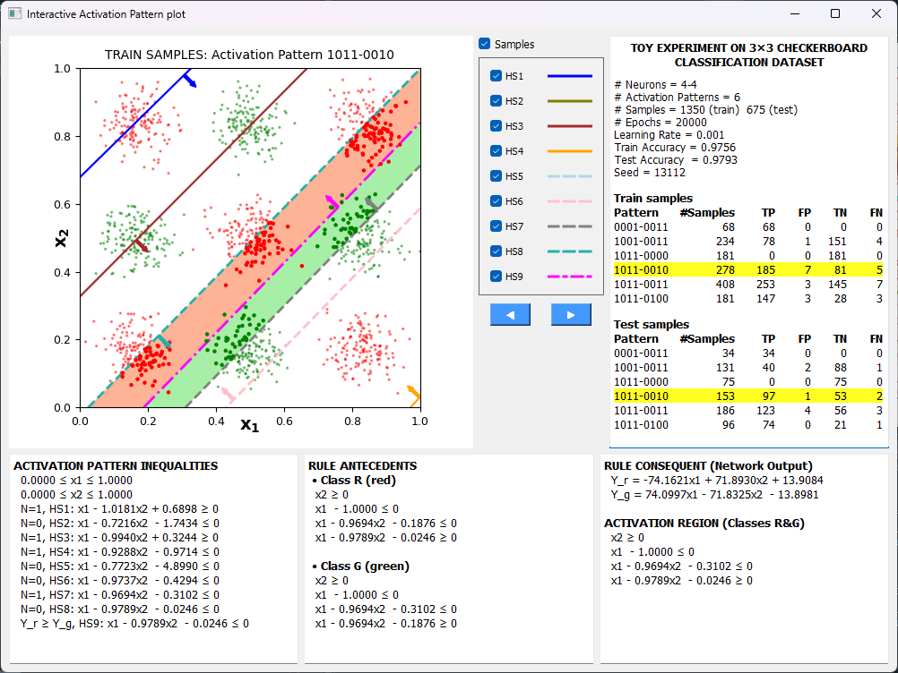

# Exact global explanations of piecewise-linear deep feedforward neural networks via rule extraction

This repository contains supplementary material for the paper:

Carles-Bou, J. L., & Carmona, E. J. (2026). **Exact global explanations of piecewise-linear deep feedforward neural networks via rule extraction**. Under revision.


# Paper Abstract

Deep feedforward neural networks (DFNNs) have achieved remarkable performance across a wide range of applications, yet their opaque decision-making processes hinder adoption in high-stakes domains where transparency, accountability, and regulatory compliance are essential. Although global explainability in neural networks has long been pursued through rule extraction techniques and, more recently, through aggregation of local explanations, existing approaches typically rely on approximation, sampling, or heuristic procedures, limiting faithful characterization of overall model behavior. 

This paper introduces G-FACE, an exact framework for global explanation in DFNNs with piecewise-linear (PWL) activation functions. Exploiting the continuous piecewise-affine structure of these networks, G-FACE transforms a trained model into an explicit rule-based knowledge representation composed of IF--THEN rules, each associated with an exact local affine mapping over a convex polyhedral activation region. A compact closed-form matrix formulation is derived to separate model parameters from input-dependent components, enabling exact and hyperparameter-free feature-level attribution. Unlike prior exact PWL approaches largely restricted to ReLU networks, the proposed framework extends to other PWL activations, including Leaky ReLU, hard sigmoid, and hard tanh. 

Beyond interpretability, the extracted rule-based representation supports advanced tasks such as local single- and multi-objective optimization and local adversarial search. Experimental use cases demonstrate the practical utility of G-FACE as a transparent and operational knowledge representation of trained neural networks.


# Introduction

G-FACE is a global explainability framework designed for piecewise-linear deep feedforward neural networks. It serves as the natural global extension of our local explainability method, FACE (Feature Attribution Computed Exactly), which computes exact local feature attributions by leverage of the network's underlying activation regions. FACE was original covered in our paper [*Achieving faithful explainability in feedforward neural networks through accurately computed feature attribution*](https://doi.org/10.1016/j.neunet.2025.108277) and in its associated [*Github repository*](https://github.com/CarlesBou/mlpxai). 


## Repository Structure & Core Samples

The core implementation files are organized as follows:

* [*src/explainers/face*](src/dfnn-face/explainers/face): Contains the PyTorch source implementation of the foundational local explainer (FACE) and its global extension (G-FACE).

* [*src/dfnn-face/notebooks*](src/dfnn-face/notebooks): Contains Jupyter notebooks examples about the utilization of the G-FACE method.

* [*src/dfnn-face/visualizers*](src/dfnn_face/visualizers): Includes the visualization tools developed to understand the activation region for low-diemensional datasets.


## Jupyter Notebook Samples

To demonstrate the mathematical properties and practical behavior of G-FACE, we provide interactive examples covering classification problems on toy datasets.

- Checkerboard Classification — Detailed mapping of alternating complex decision boundaries ([View Notebook](https://github.com/CarlesBou/dfnn-face/blob/main/src/dfnn_face/notebooks/Damero.ipynb))
- Circle Classification — A clear demonstration of how piecewise-linear regions approximate smooth, circular boundaries exactly ([View Notebook](https://github.com/CarlesBou/dfnn-face/blob/main/src/dfnn_face/notebooks/Circle.ipynb))


## Interactive Visualization Tools

For low-dimensional toy datasets, the repository includes a Python toolbox located in <code>src/dfnn-face/visualizers</code> designed to map and display the exact polyhedral activation regions extracted by our methods.

These interactive visualization tools allow you to inspect the exact local affine mappings and feature attributions visually and interactively, illuminating how the global decision space is partitioned into distinct local rule zones.


### Classification Space Visualizer

The classification tool, <code>Classification_qt.py</code>, maps out how the network partitions the input space into unique activation regions, showcasing the exact decision boundaries along with the individual samples falling within each convex polyhedron.




### Regression Space Visualizer

The regression tool, <code>Regression_qt.py</code>, provides an explicit visual look at the piecewise-affine response surface of the network, highlighting how the continuous linear segments connect across boundary regions to form the global prediction function.


## Installation

To clone the project repository along with the source code, samples, and visualization tools, run the following command in your terminal:

```sh
git clone https://github.com/CarlesBou/dfnn-face.git
cd dfnn-face
```


### Environment Setup

It is highly recommended to install the project dependencies inside a isolated virtual environment to avoid conflicts with your system packages. You can create and activate a virtual environment, then install the required libraries defined in <code>requirements.txt</code> by running:

### On Linux/macOS:

```sh 
# Create a virtual environment named 'venv'
python3 -m venv venv

# Activate the virtual environment
source venv/bin/activate

# Upgrade pip and install the dependencies
pip install --upgrade pip
pip install -r requirements.txt
```

### On Windows:

```sh 
# Create a virtual environment named 'venv'
python -m venv venv

# Activate the virtual environment
.\venv\Scripts\activate

# Upgrade pip and install the dependencies
pip install --upgrade pip
pip install -r requirements.txt
```


## Licenses
This project is licensed under the Apache License 2.0 - See the LICENSE file for details.