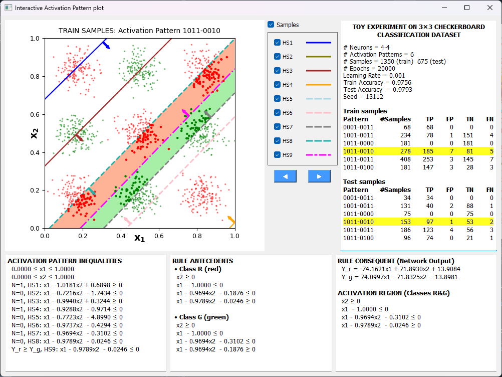

# Constructing exact rule-based symbolic representations of piecewise-linear deep feedforward neural networks

This repository contains supplementary material for the paper:

Carles-Bou, J. L., & Carmona, E. J. (2026). **Constructing exact rule-based symbolic representations of piecewise-linear deep feedforward neural networks**. Under revision.


# Paper Abstract

Deep feedforward neural networks (DFNNs) have achieved remarkable success across numerous domains, but their internal decision-making process remains largely opaque, limiting transparency, trust, and regulatory compliance in high-stakes applications. Existing explainability approaches typically rely on approximate global rule extraction techniques or local feature attribution methods, neither of which provides an exact symbolic characterization of the network behavior. 

This paper introduces R-FACE, a framework that constructs an exact symbolic representation of the input-output behavior of piecewise-linear (PWL) DFNNs over a  user-defined set of interest (SOI). Rather than approximating the network globally, R-FACE identifies the regions induced by the SOI. The resulting symbolic representation consists of a collection of exact IF–THEN rules, each encoding the polyhedral constraints (antecedent) together with the corresponding affine output model (consequent) of a single region. The proposed framework is built upon a compact closed-form matrix formulation, enabling the exact computation of both the affine model and the corresponding feature attributions for each region. 

Furthermore, while existing exact analyzes have largely focused on ReLU networks, our framework naturally extends to other PWL activation functions, including Leaky ReLU, hard sigmoid, and hard tanh. The resulting representation provides a unified basis for multiple exact analyzes by enabling behavioral queries, including exact feature attribution, constrained optimization, and adversarial example generation. Representative use cases on both regression and classification problems illustrate the correctness, versatility, and practical applicability of the proposed framework.


# Introduction

R-FACE is a regional explainability framework designed for piecewise-linear deep feedforward neural networks. Rather than approximating the network globally, it constructs an exact symbolic representation of the network's input-output behavior over a user-defined set of interest (SOI). It serves as the natural regional extension of our local explainability method, FACE (Feature Attribution Computed Exactly), which computes exact local feature attributions by leveraging the network's underlying activation regions. By identifying the specific regions induced by the SOI, R-FACE extracts exact IF–THEN rules that encode both the polyhedral constraints and the corresponding affine output models. 

FACE was originaly covered in our paper [*Achieving faithful explainability in feedforward neural networks through accurately computed feature attribution*](https://doi.org/10.1016/j.neunet.2025.108277) and in its associated [*Github repository*](https://github.com/CarlesBou/mlpxai). 


## Repository Structure & Core Samples

The core implementation files are organized as follows:

* [*src/explainers/face*](src/dfnn_face/explainers/face): Contains the PyTorch source implementation of the foundational local explainer (FACE) and its regional extension (R-FACE).

* [*src/dfnn-face/notebooks*](src/dfnn_face/notebooks): Contains Jupyter notebooks examples about the utilization of the R-FACE method.

* [*src/dfnn-face/visualizers*](src/dfnn_face/visualizers): Includes the visualization tools developed to understand the activation region for low-diemensional datasets.


## Jupyter Notebook Samples

To demonstrate the mathematical properties and practical behavior of R-FACE, we provide interactive examples covering classification problems on toy datasets.

- Checkerboard Classification — Detailed mapping of alternating complex decision boundaries ([View Notebook](https://github.com/CarlesBou/dfnn-face/blob/main/src/dfnn_face/notebooks/Damero.ipynb))
- Circle Classification — A clear demonstration of how piecewise-linear regions approximate smooth, circular boundaries exactly ([View Notebook](https://github.com/CarlesBou/dfnn-face/blob/main/src/dfnn_face/notebooks/Circle.ipynb))


## Interactive Visualization Tools

For low-dimensional toy datasets, the repository includes a Python toolbox located in <code>src/dfnn-face/visualizers</code> designed to map and display the exact polyhedral activation regions extracted by our methods.

These interactive visualization tools allow you to inspect the exact local affine mappings and feature attributions visually and interactively, illuminating how the decision space is partitioned into distinct local rule zones.


### Classification Space Visualizer

The classification tool, <code>Classification_qt.py</code>, maps out how the network partitions the input space into unique activation regions, showcasing the exact decision boundaries along with the individual samples falling within each convex polyhedron.




### Regression Space Visualizer

The regression tool, <code>Regression_qt.py</code>, provides an explicit visual look at the piecewise-affine response surface of the network, highlighting how the continuous linear segments connect across boundary regions.


## Installation

To clone the project repository along with the source code, samples, and visualization tools, run the following command in your terminal:

```sh
git clone https://github.com/CarlesBou/dfnn-face.git
cd dfnn-face
```


### Environment Setup

It is highly recommended to install the project dependencies inside a isolated virtual environment to avoid conflicts with your system packages. You can create and activate a virtual environment, then install the required libraries defined in <code>requirements.txt</code> by running:

### On Linux/macOS:

```sh 
# Create a virtual environment named 'venv'
python3 -m venv venv

# Activate the virtual environment
source venv/bin/activate

# Upgrade pip and install the dependencies
pip install --upgrade pip
pip install -r requirements.txt
```

### On Windows:

```sh 
# Create a virtual environment named 'venv'
python -m venv venv

# Activate the virtual environment
.\venv\Scripts\activate

# Upgrade pip and install the dependencies
pip install --upgrade pip
pip install -r requirements.txt
```


## Licenses
This project is licensed under the Apache License 2.0 - See the LICENSE file for details.
